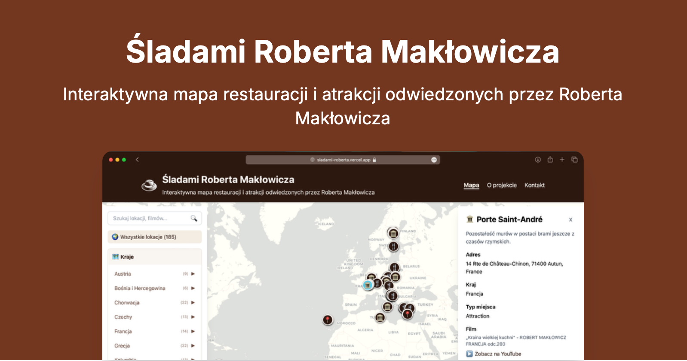

# Śladami Roberta Makłowicza 🍴🗺️

An interactive map showcasing restaurants, attractions, and other locations visited by Robert Makłowicz in his culinary travel shows.

## Features

- 🗺️ Interactive map with all locations visited by Robert Makłowicz
- 🏷️ Location categorization (restaurants 🍴, attractions 🏛️, other places 📍)
- 🌍 Country-based filtering
- 📺 Video-based filtering
- 📱 Responsive design
- 🔍 Detailed location information including:
  - Description
  - Address
  - Country
  - Type (restaurant/attraction/other)

## Tech Stack

- Next.js 15
- React 18
- TypeScript
- Tailwind CSS
- Leaflet for maps
- YouTube Data API for video data
- Google Maps API for location parsing
- Google Gemini AI for location descriptions

## Getting Started

### Prerequisites

- Node.js 18+ and npm
- A Google API key with YouTube Data API v3 enabled
- A Google Maps API key for location parsing
- A Google Gemini API key for AI-powered location descriptions

### Environment Setup

Create a `.env` file in the root directory with:

```env
YOUTUBE_API_KEY=your_api_key_here
GOOGLE_MAPS_API_KEY=your_api_key_here
GEMINI_API_KEY=your_api_key_here
```

### Installation

1. Clone the repository:
```bash
git clone https://github.com/przekwaskrzysiek/maklowicz-map.git
cd maklowicz-map
```

2. Install dependencies:
```bash
npm install
```

3. Run the development server:
```bash
npm run dev
```

The application will be available at [http://localhost:3000](http://localhost:3000)

### Scripts

- `npm run dev` - Start development server
- `npm run build` - Build for production
- `npm run start` - Start production server
- `npm run lint` - Run linting
- `npm run sitemap` - Generate sitemap
- `npm run parse-location` - Parse Google Maps URL into location data (usage: `npm run parse-location "https://maps.google.com/..."`)
- `npm run parse-video` - Parse YouTube video URL into video data (usage: `npm run parse-video "https://youtube.com/watch?v=..."`)

## Data Structure

The application uses a single data file:

1. `locations.json` - Contains all location data organized by videos, where each video contains:
   - `videoId`: YouTube video ID
   - `videoUrl`: Full YouTube video URL
   - `title`: Video title
   - `filterTitle`: Filtered video title for display purposes
   - `playlistId`: YouTube playlist ID
   - `playlistTitle`: Playlist title
   - `date`: Video upload date
   - `show`: Show name
   - `locations`: Array of locations featured in the video, each containing:
     - `id`: Unique identifier
     - `name`: Location name
     - `description`: Location description
     - `latitude`: Geographic latitude
     - `longitude`: Geographic longitude
     - `address`: Full address
     - `country`: Country name
     - `type`: Location type ('restaurant', 'attraction', or 'other')
     - `websiteUrl`: Website URL (optional)
     - `GoogleMapsLink`: Google Maps URL (optional)
     - `image`: Image URL/path (optional)

## Contributing

Contributions are welcome! Please feel free to submit a Pull Request.

## License

This project is open source and available under the [MIT License](LICENSE).

## Acknowledgments

- Robert Makłowicz for his amazing culinary travel shows
- All contributors who help maintain and improve this project 